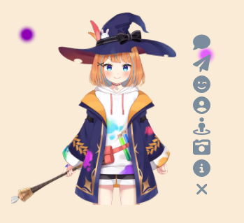

# <center>Live2d-Widget-v3

---

## 1 介绍

+ **演示地址**：[DEMO](https://letere-gzj.github.io/live2d-widget-v3/)
+ **文章教程**：[【Hugo】博客引入moc3类型的live2d模型](https://letere-gzj.github.io/hugo-stack/p/hugo/live2d-moc3/)



> [!NOTE]
> + （1）此项目是基于【[stevenjoezhang/live2d-widget](https://github.com/stevenjoezhang/live2d-widget)】项目的二次开发
> + （2）原本live2d-widget只能渲染moc模型，无法渲染moc3模型，于是此项目在原版的架构上，对接了新版的Cubism SDK for Web(sdk当前版本v5)，来渲染moc3模型
> + （3）因为是基于live2d-widget项目的二次开发，使用体验上与原版的live2d-widget相差不大，基本的功能都有所保留

> [!TIP]
>  + **Tips:** 此项目暂适配moc3模型，并不适配moc模型，且暂时未考虑适配moc模型

---

## 2 使用方法

### 2.1 基础引入

+ 在页头(head)或页脚(footer)引入以下脚本代码，演示的模型是官方SDK自带的模型
```html
<script>
  const cdnPath = 'https://cdn.jsdelivr.net/gh/letere-gzj/live2d-widget-v3@main';
  const config = {
    // 资源路径
    path: {
      homePath: '/',
      modelPath: cdnPath + "/Resources/",
      cssPath: cdnPath + "/waifu.css",
      tipsJsonPath: cdnPath + "/waifu-tips.json",
      tipsJsPath: cdnPath + "/waifu-tips.js",
      live2dCorePath: cdnPath + "/Core/live2dcubismcore.js",
      live2dSdkPath: cdnPath + "/live2d-sdk.js"
    },
    // 工具栏
    tools: ["hitokoto", "asteroids", "express", "switch-model", "switch-texture", "photo", "info", "quit"],
    // 模型拖拽
    drag: {
      enable: true,
      direction: ["x", "y"]
    },
    // 模型切换(order: 顺序切换，random: 随机切换)
    switchType: "order"
  }

  // 加载资源并初始化
  if (screen.width >= 768) {
    Promise.all([
      loadExternalResource(config.path.cssPath, "css"),
      loadExternalResource(config.path.live2dCorePath, "js"),
      loadExternalResource(config.path.live2dSdkPath, "js"),
      loadExternalResource(config.path.tipsJsPath, "js")
    ]).then(() => {
      initWidget({
        homePath: config.path.homePath,
        waifuPath: config.path.tipsJsonPath,
        cdnPath: config.path.modelPath,
        tools: config.tools,
        dragEnable: config.drag.enable,
        dragDirection: config.drag.direction,
        switchType: config.switchType
      });
    });
  }

  // 异步加载资源
  function loadExternalResource(url, type) {
    return new Promise((resolve, reject) => {
      let tag;
      if (type === "css") {
        tag = document.createElement("link");
        tag.rel = "stylesheet";
        tag.href = url;
      }
      else if (type === "js") {
        tag = document.createElement("script");
        tag.src = url;
      }
      if (tag) {
        tag.onload = () => resolve(url);
        tag.onerror = () => reject(url);
        document.head.appendChild(tag);
      }
    });
  }
</script>
```

---

### 2.2 参数说明

+ 通过修改config对象的参数，实现自定义效果

|                                     参数                                     | 说明                                                                                                                                                                                                                           |
|:--------------------------------------------------------------------------:|:-----------------------------------------------------------------------------------------------------------------------------------------------------------------------------------------------------------------------------|
|                             **path.homePath**                              | 网站主页路径，若域名后有子路径，则将子路径填写上，结尾记得带上 `/` , 如果没有子路经则 `/` 就好，用来显示live2d的时间提示语                                                                                                                                                       |
|                             **path.modelPath**                             | 模型文件的路径，即可访问到model和model_list.json文件的路径，可搭配【[jsDelivr](https://www.jsdelivr.com/)】来使用cdn路径                                                                                                                                   |
|                              **path.cssPath**                              | live2d画布的css样式的路径，可直接在仓库下载此文件，来自定义自己想要的样式，然后通过本地或cdn引入自己改好的css文件                                                                                                                                                             |
|                           **path.tipsJsonPath**                            | live2d提示语json文件的路径，默认适配hexo-next主题，可直接在仓库下载此文件，来自定义适配自己的主题，然后通过本地或cdn引入自己改好的json文件                                                                                                                                           |
| **path.tipsJsPath**<br> **path.live2dCorePath**<br> **path.live2dSdkPath** | 代码核心文件路径，不建议修改                                                                                                                                                                                                               | |
|                                 **tools**                                  | 工具栏按钮：<br> **（1）hitokoto**: 一言<br> **（2）asteroids**: 网页飞机小游戏<br> **（3）express**: 切换模型表情<br> **（4）switch-model**: 切换模型分组<br> **（5）switch-texture**: 切换分组下的模型<br> **（6）photo**: 截图<br> **（7）info**: 作者信息<br> **（8）quit**: 隐藏模型 |
|                              **drag.enable**                               | 是否开启模型拖拽功能（true:开启, false:关闭）                                                                                                                                                                                                |
|                             **drag.direction**                             | 模型拖拽方向（x:水平移动, y:垂直移动）                                                                                                                                                                                                       |
|                               **switchType**                               | 模型切换顺序（order:顺序切换, random:随机切换）                                                                                                                                                                                              |

---

### 2.3 引入自己的模型

#### 2.3.1 目录结构说明

+ 模型的引入完全可以参考本仓库的 **Resources** 目录下的模型，以及对应的写法
+ **model**：模型存放的位置
+ **model_list.json**：要被加载的模型的列表

---

#### 2.3.2 修改方法

+ (1) 本地仿照 **Resources** 目录，创建一个model文件夹，以及model_list.json文件

+ (2) 将自己的模型放入model文件夹

+ (3) 按实际情况修改model_list.json文件
  + **tips**：模型文件夹路径是以model文件夹为根目录进行填写，具体参考 **Resources** 目录
```json
{
    "models": [
        ["模型1文件夹路径", "模型2文件夹路径"],
        ["模型3文件夹路径"]
    ],
    "messages": [
        ["模型1入场语", "模型2入场语"],
        ["模型3入场语"]
    ]
}
```

+ (4) 上传文件到资源服务器，修改 **path.modelPath** 参数，通过cdn形式引入
  + **tips**: 可通过【[jsDelivr](https://www.jsdelivr.com/)】搭配github仓库形式引入

---

#### 2.3.3 修改模型配置

+ **(1) 调整模型大小和位置**
  + 在模型目录下，创建`config.json`文件，并填写下面的参数，具体参考 **Resources** 目录下的模型
  + 调整模型大小和位置，可以搭配 [DEMO](https://letere-gzj.github.io/live2d-widget-v3/) 使用
  + **scale**: 模型大小
  + **translate.x**：模型x轴偏移量
  + **translate.y**：模型y轴偏移量
```json
{
  "scale": 1.0,
  "translate": {
    "x": 0.0,
    "y": 0.0
  }
}

```

+ **(2) 配置模型表情**
  + 若模型存在`xxx.exp3.json`类型的文件，可以通过修改`xxx.model3.json`文件，来配置表情，具体参考 **Resources** 目录下的模型
```json
{
  ...
  "FileReferences": {
    ...,
    "Expressions": [
      {
        "Name": "表情名",
        "File": "表情文件路径"
      }
    ]
  }
}
```


+ **(3) 配置模型动作与声音**
  + 若模型存在`xxx.motion3.json`文件，可以通过修改`xxx.model3.json`文件，来配置动作以及对应的声音，具体参考 **Resources** 目录下的模型
  + **Idle**：闲置动作，会一直从闲置动作数组中，随机选一个进行播放
  + **TapBody**：点击动作，当点击live2d画布时，才会从点击动作数组中，随机选一个进行播放
```json
{
  ...
  "FileReferences": {
    ...
    "Motions": {
      "Idle": [
        {
          "File": "动作文件路径"
        }
      ],
      "TapBody": [
        {
          "File": "动作文件路径",
          "Sound": "声音文件路径"
        }
      ]
    }
  }
}
```


---

## 3 推荐项目
+ 如果你需要moc模型与moc3模型都能适配的技术，个人推荐使用以下项目
+ [oh-my-live2d/oh-my-live2d](https://github.com/oh-my-live2d/oh-my-live2d)
+ [Konata09/Live2dOnWeb](https://github.com/Konata09/Live2dOnWeb)

---

## 4 参考文献
+ [笔记：live2d4.0 sdk 博客园网页动画](https://blog.csdn.net/weixin_44128558/article/details/104792345)
+ [live2d（Web SDK 4.x）Web看板娘进阶](https://blog.csdn.net/qq_37735413/article/details/119413744)
+ [live2d web笔记之一：官方SDK尝试](https://blog.csdn.net/weixin_42578046/article/details/123509508)
